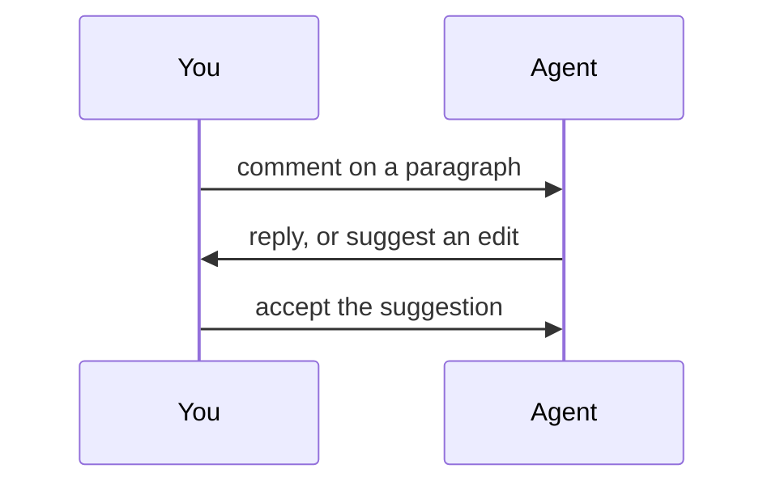

# Welcome to Quarry

This is a live, shared document. Your coding agent is connected to it right now — and so is anyone else with this link. Edits, comments, and cursors sync in real time.

## Try it yourself

- Click anywhere and start typing. Your agent sees the change immediately.
- Select some text and add a comment — ask your agent a question, and it can reply in the thread.
- Your agent has left a suggestion below. Accept it or reject it; either way, the agent is notified.

## A sentence that needs work

This sentence have a grammar mistakes that your agent can offer to fix.

## What a Quarry document can hold

Quarry documents are structured Markdown blocks, so everything round-trips cleanly to plain `.md`:

| Feature | You | Your agent |
| --- | --- | --- |
| Edit text | ✅ | ✅ |
| Comments and replies | ✅ | ✅ |
| Suggestions (tracked changes) | ✅ | ✅ |
| Presence and live cursors | ✅ | ✅ |

```rust
fn main() {
    println!("code blocks, with syntax highlighting");
}
```



> Headings, lists, tables, blockquotes, images, and horizontal rules all work too.

---

## When you're done

Tell your agent what to change — in a comment right here, or back in your terminal. This document stays available at its URL until it expires (30 days by default), and `quarry open` can always mint a new one.
