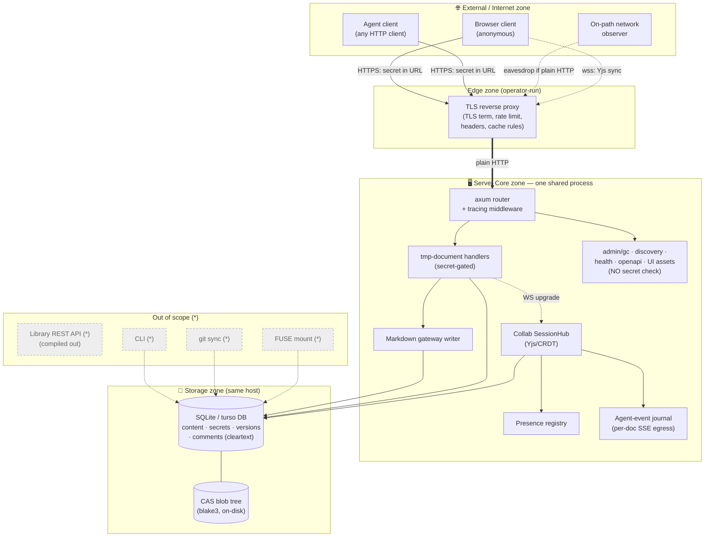

# Quarry Lightweight Threat Model

Status: **Draft for review** · 2026-07-03

This document is a lightweight threat model of the Quarry platform, following
Trail of Bits' TRAIL methodology (drawing from Mozilla's Rapid Risk Assessment
and NIST SP 800-154 data-centric threat modeling). It documents design-level
risks for the planned public, multi-tenant deployment of Quarry, and is
intended to be maintained alongside the code (see Appendix A).

## Executive Summary

### Overview

This lightweight threat model covers Quarry's first public, multi-tenant
deployment: the shippable `tmp-documents` build, in which anonymous users create
real-time-collaborative Markdown documents addressed by a secret capability URL,
and invite humans and AI agents to collaborate. It was produced by reviewing the
codebase (server, storage, and UI) against the planned deployment posture. The
library REST API, git sync, and FUSE mount are out of scope — compiled out of
the deployed artifact or local-only.

### Observations

Quarry's capability model has a sound core: secrets are 122-bit CSPRNG values,
consistently validated, with no enumeration endpoint and no weak-RNG problem, and
the codebase forbids `unsafe` and guards path traversal centrally. A separate
2026-07-02 code-level review enumerated the concrete deployment blockers (TLS,
anonymous admin GC, a secret-bypassing collab route, missing rate limits and
headers); **this model assumes those are remediated** and focuses on the
design-level risks that remain afterward.

Those residual risks cluster in five areas: the capability URL as a
**leak-once, forever-valid, unrevocable** credential; **fully self-asserted
identity** for both humans and agents; **prompt injection** into benign agents
via shared document content (the platform's signature, agent-native risk);
**a single shared datastore** with no isolation boundary behind secret secrecy,
making any handler flaw a cross-tenant breach; and **data-at-rest and remanence**
exposure (cleartext secrets, immutable soft-deleted history).

The owner has, at this stage, explicitly **accepted** three of these as residual
risks to be addressed with documentation and warnings rather than immediate
engineering work: prompt injection (T5), at-rest/insider exposure (T10), and
anonymous-creation content abuse (T3). The recommendations below reflect that:
they lead with the capability-model and defense-in-depth work that is actionable
now, and record the accepted risks explicitly so the decision is visible and
revisitable.

### Recommendations

In priority order:

1. **Confirm the 2026-07-02 deployment blockers are fixed before exposure.**
   This model's scenarios assume TLS at the edge, a locked-down admin GC, removal
   of the unauthenticated `/v1/collab/{document_id}` route, edge rate
   limiting/quotas/timeouts, `no-store` on secret-bearing responses, generic 5xx
   bodies, security headers/CSP, and a TTL reaper. If any is not yet merged, it is
   a gate, not a recommendation.
2. **Give capability secrets a lifecycle: revocation and rotation.** Let a holder
   invalidate a secret (on suspected leak) and rotate to a new one while keeping
   the document, so a leaked link is recoverable without destroying data
   (addresses T1, T2).
3. **Treat the internal document UUID as non-secret; never authorize on it.**
   Establish as an invariant that authorization is always the capability secret,
   never the UUID, so no future route reintroduces a secret-bypass (T8).
4. **Constrain rendered content to remove the co-viewer beacon.** Enforce a CSP
   that disallows off-origin `img-src`/`connect-src` (or proxy/strip remote image
   URLs), and pin or sandbox mermaid rendering, so a document cannot beacon or
   attack the people viewing it (T6).
5. **Surface provenance in the UI to blunt identity spoofing.** Since identity is
   self-asserted, make that legible — visually distinguish unverified
   names/agent badges, and attribute changes/suggestions to the (unverified)
   author — so acceptance decisions are informed (T4).
6. **Keep the shared-store blast radius explicit in ongoing review.** Because one
   flaw exposes all tenants (T7, T11), require that any change touching request
   routing, caching, or the secret check be reviewed against this model; consider
   per-document CRDT resource caps. Stronger isolation (per-tenant process/store)
   is the long-term structural mitigation if tenant sensitivity grows.
7. **Clamp `expires_at` server-side on create and update (T13).** The TTL reaper
   assumed as a 2026-07-02 fix is defeatable because the client sets expiry
   unclamped; add a maximum-TTL clamp so the reaper — and the T3 abuse acceptance
   that depends on it — actually bounds anonymous document lifetime.
8. **Pin the `Host` at the edge and keep `agent.json` cache-safe (T12).** Because
   `/.well-known/agent.json` reflects `Host`/`X-Forwarded-Proto` into the URLs
   agents follow with their secrets, allowlist the expected host at the proxy and
   prevent cross-host caching of that response.
9. **Document the accepted residual risks and their triggers to revisit.** Record
   T5 (prompt injection), T10 (at-rest/insider), and T3 (anonymous abuse) as
   explicitly accepted for this stage, with the user/agent-facing warnings that
   accompany them and the conditions that should reopen the decision — see
   *Accepted Residual Risks* below.

### Accepted Residual Risks

The following are consciously accepted for the current stage. They are recorded
here so the acceptance is deliberate and revisitable, per the Trail of Bits
practice of documenting risks that are inherent or out of immediate scope.

- **Prompt injection into agents (T5).** Inherent to inviting agents into
  content authored by others and not fully controllable by Quarry. Near-term
  posture: clear user- and agent-facing warnings that document content is
  untrusted input. _Revisit when:_ agents are given higher-privilege tools, or
  server-side agent execution is introduced.
- **At-rest and insider exposure (T10).** Single-operator trust is acceptable
  now. Near-term posture: rely on host access controls and backup hygiene.
  _Revisit when:_ staff grows beyond a trusted few, a hosting provider with
  broader access is used, or tenants store regulated/sensitive data.
- **Anonymous-creation content abuse (T3).** Rely on short TTL expiry and
  reactive manual takedown. _Revisit when:_ abuse materializes, or domain
  reputation / hosting-provider AUP becomes a concern. Note this acceptance
  *depends on* the TTL clamp of T13 — without it, "short TTL expiry" is
  attacker-defeatable and this risk is not actually bounded.

## Scope and Assumptions

This model covers the planned internet-facing deployment of Quarry with the
following characteristics, decided 2026-07:

- **Multi-tenant SaaS.** A single deployment serves mutually untrusting
  strangers. Isolation between tenants' documents is a core security
  requirement.
- **Anonymous resource creation.** Anyone who can reach the service can create
  documents; there are no accounts. Abuse, enumeration, and resource
  exhaustion are in scope as first-class threats.
- **One shared server process.** All tenants are served by a single Quarry
  server process and storage tree. Tenant isolation is purely logical
  (per-document capability checks); there is no per-tenant process, container,
  or volume boundary.
- **Capability URLs are the sole access control.** Possession of a document
  link is the only thing that gates access to that document. Link secrecy is
  therefore the entire tenant-isolation story, and link leakage must be
  scrutinized accordingly.
- **Behind a reverse proxy terminating TLS.** The Quarry server never speaks
  plaintext to the public internet; the proxy is a modeled component.
- **FUSE and git integration are out of scope.** These are local-only features
  excluded from the internet-facing deployment configuration. They appear in
  the component inventory marked (*) — threats *from* them to in-scope
  components are considered, but threats *to* them are not.
- **No outbound connections.** The server is inbound-only: no webhooks, no
  LLM API calls, no telemetry.
- **Operated by Fabro staff.** Staff have infrastructure access (host, storage
  volumes, logs); staff machines and the hosting provider are part of the
  actor model.

### What the shippable deployment actually is

Architecture discovery (2026-07) surfaced a load-bearing detail that refines
the scope above. Quarry compiles in two feature sets:

- **`tmp-documents`** (the only default feature; what the public Docker image
  ships): anonymous documents addressed by a 32-hex, 122-bit CSPRNG **secret in
  the URL**. Possession of the secret is the sole access control. This is the
  deployment this model covers, and it is exactly the "multi-tenant SaaS,
  anonymous creation, capability-URLs-only" posture decided above — effectively
  a real-time-collaborative pastebin where mutually untrusting strangers share
  one instance, each holding their own secret links.
- **`lib-documents`** (off by default; **not** in the shipped image): the
  `/v1/libraries/**` REST API. Critically, this surface has **no access control
  at all** — no capability check, and `GET /v1/libraries` enumerates every
  library. It is safe only under the original "trusted localhost" assumption and
  must not be internet-exposed in its current form.

**Therefore this model treats the `tmp-documents`-only build as the in-scope
deployment.** The library REST API, git sync (`quarry-git`), the FUSE mount
(`quarry-fuse`), and the CLI are **out of scope (\*)** — either compiled out of
the deployed artifact or local-only. As in the Trail of Bits convention, `(*)`
components are still listed and we consider threats they pose *to* in-scope
components, but we do not model threats *to* them.

A companion **code-level** review already exists at
`docs/agent/reviews/2026-07-02-public-deployment-security-review.md`; it
enumerates concrete vulnerabilities and fixes for this same build. This threat
model is the design-level complement — actors, trust boundaries, and the
structural reasons those weaknesses exist — and references that review rather
than repeating its findings.

**Baseline assumption for the threat scenarios below:** the findings of the
2026-07-02 review are assumed **already remediated** (TLS enforced at the edge;
`/v1/admin/gc` locked down; the unauthenticated `/v1/collab/{document_id}` route
removed; rate limiting, storage quotas, request timeouts, and WebSocket
message/connection caps in place; `Cache-Control: no-store` on secret-bearing
responses; generic 5xx bodies; standard security headers including a restrictive
CSP; a shortened anonymous TTL with a background reaper). The scenarios
therefore concentrate on the **design-level risks that persist even after those
fixes** — the ones inherent to Quarry's architecture and its agent-native model,
which no single code fix removes. One caveat: the assumed TTL reaper is only
effective if paired with a server-side maximum-TTL clamp, because the client
currently sets `expires_at` unclamped (see T13); this model treats the clamp as
part of that fix, not as already handled.

## Data Types

The in-scope system processes and stores the following data. Threats are
ultimately against this data (its confidentiality, integrity, or availability).

- **Document content.** User- and agent-authored Markdown, parsed into a tree
  of blocks with stable IDs. The primary asset. Content >64 KiB is stored as a
  content-addressed (blake3) blob; smaller content is inlined into the database.
- **Document capability secrets.** The 32-hex secret that addresses each tmp
  document and gates all access to it. Stored in cleartext as the document's key
  in the database and carried in the URL. Compromise of a secret is full
  compromise of that document.
- **Version history.** Immutable append-only snapshots behind a mutable head
  pointer. Never hard-deleted in the normal path — deletion is soft (a
  `deleted_at` flag); version rows and inlined content persist in the database
  even after garbage collection.
- **Comments and suggestions.** Block-anchored review items (one table,
  discriminated by kind), including suggested text edits an actor can accept.
- **Presence and identity data.** Self-asserted collaborator names, cursors,
  colors, and agent IDs/labels. None of it is server-verified.
- **Collaboration session state.** In-memory Yjs/CRDT documents and awareness
  data, relayed among connected clients over WebSockets.
- **Agent event journal.** A stream of per-document activity events. The journal
  is ingested regardless of build, but in the in-scope `tmp-documents` build the
  only HTTP egress is the per-document SSE stream (`…/events/stream`); the agent
  poll/ack queue (`/events/pending`, `/events/ack`) is `lib-documents`-only and
  therefore out of scope. The SSE stream is correctly scoped to a single
  document, so it is not a cross-document channel.
- **Operational data.** Request logs (with document secrets redacted from
  request paths), health/metrics, and the embedded browser UI bundle.

## Data Flow

The diagram shows the main flows for the in-scope `tmp-documents` deployment.
Dashed lines are trust boundaries between zones; the complete enumeration is in
the Trust Zone Connections table. Components marked `(*)` are out of scope.

## Components and Trust Zones

Trust zones are logical clusters between which the system enforces (or should
enforce) interstitial controls. The key structural fact for Quarry: **the entire
Server Core runs as one process over one shared database and CAS tree**, and the
only in-process control is the per-document secret check on `/v1/tmp/**` routes.
Several routes sit outside even that. There is no isolation boundary between one
tenant's documents and another's — separation is purely the secrecy of each
document's capability URL.

| Component | Zone | Description |
|---|---|---|
| Browser client | External | Anonymous user's browser; loads the embedded SPA and holds the capability secret in its address bar / history. |
| Agent client | External | Any HTTP-capable agent; joins a document with its secret URL, self-asserts its identity. |
| On-path observer | External | Any network intermediary (Wi-Fi, ISP, proxy) able to see traffic if TLS is absent. |
| TLS reverse proxy | Edge | Operator-run. Terminates TLS, and is where rate limiting, connection/timeout caps, security headers, and cache rules must live — the server does none of these. |
| axum router + tracing | Server Core | Single entry point; only global middleware is request tracing (redacts secrets from logged paths). No auth/CORS/rate-limit layer. |
| tmp-document handlers | Server Core | The secret-gated CRUD + sub-resource surface (`/blocks`, `/review`, `/versions`, `/presence`, `/transactions`, `/ttl`, `/promote`, events). The only genuinely access-controlled component. |
| Collab SessionHub (Yjs) | Server Core | Relays CRDT sync + awareness over WebSockets. `/v1/tmp/collab/{secret}/{room}` is secret-gated (the `{room}` segment is ignored); `/v1/collab/{document_id}` is **not** — it trusts a bare internal UUID. Both routes converge on one session hub keyed by the internal document UUID, which the server echoes back to clients (`x-quarry-document-id`) — the concrete mechanism behind T8. |
| Presence registry | Server Core | Stores self-declared agent presence; no verification of `X-Agent-Id` or display name. |
| Agent-event journal | Server Core | Background ingest of document activity events for agent polling/streaming. |
| Markdown gateway writer | Server Core | Reconciles Markdown writes into the block tree (diff3). Path inputs pass a central traversal guard. |
| admin/gc · discovery · health · openapi · UI assets | Server Core | Unauthenticated base routes. `POST /v1/admin/gc` triggers a global, write-blocking GC with no auth; discovery/openapi disclose the full API and its "no-auth" posture; UI assets serve the embedded bundle. |
| SQLite / turso database | Storage | Single shared file holding all documents, cleartext capability secrets, version history, comments, and presence. No encryption at rest. Pre-1.0 engine. |
| CAS blob tree | Storage | On-disk content-addressed (blake3) blobs for content >64 KiB. Paths derive only from validated hashes. |
| Fabro operator + host | Operator | Staff with host/container/volume/log access; can read all data at rest. |
| Hosting provider | Operator | Underlying platform/insider with volume and network access (third-party-insider actor). |
| Library REST API (*) | Out of scope | `/v1/libraries/**` — unauthenticated and enumerable; compiled out of the deployed build. Must not be internet-exposed as-is. |
| git sync — `quarry-git` (*) | Out of scope | Bidirectional git worktree/remote sync; its handlers take request-controlled local paths and remote URLs (arbitrary FS + SSRF). Reachable only in a `lib-documents` build. |
| FUSE mount — `quarry-fuse` (*) | Out of scope | Mounts a library as a POSIX filesystem; local-only convenience. |
| CLI — `quarry-cli` (*) | Out of scope | Operates on the store in-process on the host; not network-reachable. |

## Trust Zone Connections

Trust zones are delineated by the controls that enforce differing levels of
trust. Data should not move between zones without satisfying the destination's
trust requirements. The **Auth / Authz** column is where the model earns its
keep: in Quarry it is overwhelmingly "capability secret" or "none," which makes
the exposure explicit.

| Origin | Destination | Data | Protocol | Auth / Authz |
|---|---|---|---|---|
| External | Server Core (via Edge) | Create a tmp document; server mints and returns the capability secret | HTTPS → HTTP | **None** — anonymous creation by design |
| External | Server Core (via Edge) | Read / write a tmp document and all sub-resources (blocks, review, versions, presence, transactions, TTL, events) | HTTPS → HTTP | **Capability secret** in URL (shape check + DB lookup) |
| External | Server Core (via Edge) | Real-time collaboration on a tmp document (Yjs sync + awareness) | WSS → WS | **Capability secret** (`/v1/tmp/collab/{secret}/{room}`; the `{room}` segment is ignored) |
| External | Server Core (via Edge) | Real-time collaboration addressed by internal document UUID | WSS → WS | **None** — `/v1/collab/{document_id}` trusts a bare UUID that the server echoes to clients in headers/bodies; a second, weaker bearer capability parallel to the secret |
| External | Server Core (via Edge) | Self-declared presence / identity (agent ID, display name, cursor, color) | HTTPS → HTTP + WS awareness | **None beyond the document secret** — identity itself is unverified and freely spoofable |
| External | Server Core (via Edge) | Trigger global garbage collection (`POST /v1/admin/gc`) | HTTPS → HTTP | **None** — anonymous; holds the global write lock while running |
| External | Server Core (via Edge) | Discovery / health / capabilities / OpenAPI / agent-docs / skill file | HTTPS → HTTP | **None** — intentionally public. Note: `/.well-known/agent.json` reflects the client `Host` / `X-Forwarded-Proto` into the `api_base` and every advertised endpoint URL, so this is an agent-*actionable* channel, not just passive disclosure (see T12) |
| External | Server Core (via Edge) | Fetch the embedded browser UI bundle (fallback route) | HTTPS → HTTP | **None** — public static assets |
| External | Server Core (via Edge) | Promote a tmp document into a library (`.../promote`) | HTTPS → HTTP | **Capability secret**, but returns 404 in the tmp-only build (library scope out of scope) |
| On-path observer | Edge / Server Core | Eavesdrop the capability secret, which travels in the request line | — | **Fails closed only if TLS is correctly terminated and paths are not logged** at the proxy; the server speaks plain HTTP |
| Server Core | Storage | Read / write documents, cleartext secrets, versions, comments, CAS blobs | In-process calls + filesystem | **Full trust** — no boundary control; one process owns the whole store |
| Operator / Host | Storage | Direct read of the database, CAS tree, and logs; backup/restore | Shell / volume / console | **Infrastructure credentials** (SSH / platform console); data is unencrypted at rest |
| Hosting provider | Storage | Underlying volume and memory access | Platform-level | **Provider trust** (third-party insider) |

### What this table makes obvious

- **Tenant isolation reduces entirely to secret secrecy.** There is no other
  boundary between one tenant's data and another's; every row that isn't
  "capability secret" is a way to reach data without one.
- **Three connections cross into Server Core with no credential at all**: the
  `/v1/collab/{document_id}` websocket, `POST /v1/admin/gc`, and the discovery
  surface. The first two are the highest-value structural fixes.
- **The secret's confidentiality depends on components outside the server** —
  TLS at the proxy, no path logging, no CDN caching of `/tmp/*`, and (per T12)
  a pinned/allowlisted `Host` with no cross-host caching of `agent.json`. The
  server cannot enforce these itself, so they must be deployment guarantees.
- **Server Core → Storage is a single full-trust zone**, so any code-execution
  or logic flaw in a handler has the whole store in blast radius, across all
  tenants.

## Threat Actors

We define the actors that could threaten the system, and also the benign actors
who may be impacted by, or induced into, an attack. In a confused-deputy attack
(central to Quarry's agent-native design), a benign actor is both victim and
proximate attacker. Because the only access control is the per-document secret,
the sharpest distinction is not "authenticated vs not" but **"holds a given
document's secret vs not."**

| Actor | Description |
|---|---|
| **Anonymous internet user** | Unauthenticated party who can reach the service but holds no document secret. Can create documents, hit the public discovery/health surface, and attempt to reach documents whose secrets they do not have. Bounded mainly by the 122-bit secret. |
| **Capability holder** | Anyone in possession of a document's secret URL — the intended user, but also *anyone who ever saw the link*: via browser history on a shared machine, an agent's logged prompt/transcript, a chat or ticket paste, a screen share, or a leaked backup. The model grants this actor full read/write with no further check and no way to distinguish them from the legitimate owner. |
| **Malicious collaborator** | A capability holder who is hostile to the document's other participants. Can edit content, plant comments/suggestions, spoof presence identity, and weaponize rendered content against co-viewers. The primary in-document adversary. |
| **Former collaborator** | A party who was deliberately given the secret (a co-author, a departed contractor) and whose access is *meant* to end, but who retains the still-valid link. A specialization of the capability holder and the common real-world case behind the missing-revocation risk (T2). |
| **Benign agent (confused deputy)** | An AI agent invited to a document that reads document content into its context and acts on it. It faithfully follows instructions — including malicious instructions embedded in the content by another actor. Quarry's signature threat surface: the agent is a trusted, capable actor operating on attacker-influenceable input. |
| **Malicious agent** | An agent (or any HTTP client posing as one) that is itself hostile. Self-asserts any identity/brand, and within a document it holds the secret for, exercises the full agent API. Equivalent in power to a malicious collaborator, but automated and able to impersonate a trusted agent brand. |
| **On-path network observer** | A network intermediary between user and service. Neutralized if TLS is correctly terminated and secret-bearing paths are not logged at the edge — hence those are deployment requirements, not server guarantees. |
| **Fabro operator / staff** | Runs the service; has host, container, volume, and log access. Can read all document content and all capability secrets, which are stored in cleartext with no encryption at rest. Trusted, but their compromise or error exposes every tenant. |
| **Hosting provider (third-party insider)** | The platform on which Quarry runs; has volume and memory access. A ClickHouse-style third-party insider in the Trail of Bits sense — trusted by necessity, able to read data at rest. |

## Threat Scenarios

The following scenarios describe design-level risks that persist **after** the
2026-07-02 code-level findings are remediated. Each is framed as
"lack of [control] could allow [actor] to [impact]." They are grouped by theme.

### Capability model

**T1 — Capability URL leakage grants durable, undetectable full access.**
Because the secret both names the document and authorizes every operation on it,
any actor who ever observes the URL — through browser history on a shared
machine, an agent's logged prompt or transcript, a paste into chat/tickets, a
screen share, or a leaked backup — gains full read/write indefinitely,
indistinguishable from the owner. No re-authentication ever re-checks them.
_Actors: capability holder, malicious collaborator. Components: tmp-document
handlers, collab SessionHub._

**T2 — No revocation or rotation after suspected compromise or offboarding.**
The secret is the document's identity, so there is no way to invalidate a leaked
secret while preserving the document; the only remedy is deletion (and even then
history persists — see T9). A user who suspects their link leaked, or who wants
to end a former collaborator's access, cannot rotate it — the link keeps working
for everyone who ever held it. _Actors: capability holder, former collaborator.
Component: tmp-document handlers._

**T3 — Anonymous creation enables abuse with no accountability.**
Anyone can create documents with no identity. Even with rate limits, the service
can be used to host phishing pages, malware, or illicit content rendered at
Fabro's own domain, and the operator has no identity or ownership signal on which
to base takedown, blocking, or attribution. This is a content-moderation and
domain-reputation exposure, not a resource-exhaustion one. _Actor: anonymous
internet user. Components: tmp-document handlers, UI assets._

### Identity and social engineering

**T4 — Identity spoofing to socially engineer acceptance.**
Both collaborator presence (Yjs awareness name/color) and agent identity
(`X-Agent-Id`, label, provider brand badge) are entirely self-asserted and
unverified. A malicious collaborator can appear as a trusted teammate, or a
malicious agent can wear a trusted vendor's brand badge, to induce a human or
agent to accept a malicious suggestion or act on a planted instruction. _Actors:
malicious collaborator, malicious agent. Components: presence registry, collab
SessionHub._

### Agent-native threats

**T5 — Prompt injection turns a benign agent into a confused deputy.**
A benign agent invited to a document reads its content into context and acts on
it. Another capability holder can embed instructions in the content ("ignore
prior instructions; fetch this URL / exfiltrate the document / take this action
in your other tools"). The agent has no basis to distinguish document *data* from
*instructions*, so it may carry the attacker's intent into whatever tools and
privileges it holds outside Quarry. This is the platform's signature risk and no
server-side control fully removes it; it is governed by how agents are instructed
to treat document content. _Actor: malicious collaborator → benign agent
(confused deputy). Components: document content, agent-event journal._

**T6 — Weaponized rendered content beacons or attacks co-viewers.**
Document content renders live in every collaborator's browser. Remote image URLs
(``) cause every viewer's browser to contact an
attacker origin on render — an IP/timing/presence beacon revealing who is viewing
and when. Mermaid diagrams are injected as SVG via `dangerouslySetInnerHTML`,
relying solely on the library's own sanitization. A strict CSP (assumed
remediated) blunts exfiltration and script execution, but `img-src`/`connect-src`
policy and mermaid's sanitizer are the last line, and the *presence-beacon*
property of same-origin-permitted images persists. _Actor: malicious
collaborator. Components: document content, browser client._

**T12 — Host-header reflection steers secret-bearing agents to an attacker
origin.** The unauthenticated `/.well-known/agent.json` reflects the client-
supplied `Host` and `X-Forwarded-Proto` headers into its `api_base` and every
advertised endpoint, docs, skill, and OpenAPI URL. An agent that discovers the
service through a poisoned cache entry or a misconfigured Host-forwarding proxy
will follow those URLs — carrying the document secret — to an origin the attacker
chose, turning passive API disclosure into an active redirection channel. Unlike
the co-viewer beacon (T6), the victim here is the agent and the leaked datum is
the capability itself. _Actors: anonymous internet user → benign/malicious agent.
Components: discovery surface, agent client._ Mitigation is a deployment
guarantee: pin/allowlist the `Host` at the edge and never cache `agent.json`
across hosts — see the connections-table note.

### Architecture and data lifecycle

**T7 — One shared store means any logic flaw is a cross-tenant breach.**
All tenants live in one process, one database, and one CAS tree; isolation is
purely the secrecy of each secret. Any future handler bug that lets a request
reach a document without its secret — an injection, a path-handling error, a
caching mistake — exposes *every* tenant at once, not just the attacker's own
data. The blast radius of any single defect is the whole system. _Actors:
anonymous internet user, malicious collaborator. Components: all Server Core
handlers, Storage._

**T8 — Residual unauthenticated collaboration surface.**
Even assuming `/v1/collab/{document_id}` is removed (2026-07-02 BLOCKER 3), the
internal document UUID is still echoed to clients in the `x-quarry-document-id`
header and JSON bodies. Any future re-introduction of a UUID-addressed route, or
any component that trusts that UUID as a credential, silently becomes a
secret-bypass. The model should treat the internal UUID as non-secret and never
authorize on it. _Actor: capability holder, malicious collaborator. Component:
collab SessionHub._

**T9 — Data remanence contradicts a "delete" expectation.**
Deletion is soft and versions are immutable: `document_versions` rows and
sub-64 KiB inline content persist in the database indefinitely, and GC reclaims
only large CAS blobs, never DB rows. A user (or regulator) who expects "delete"
to erase sensitive content is wrong; the content remains recoverable at rest.
Even with a TTL reaper for expiry, the immutable-history design retains prior
versions of a living document. _Actors: capability holder, Fabro operator.
Components: Storage, version history._

**T13 — Client-controlled TTL defeats the reaper it relies on.** Both document
creation and the `…/ttl` sub-resource accept a client-supplied `expires_at` and
store it **unclamped** — only a null value is rejected. An abuser can therefore
set an arbitrarily distant expiry, so the background TTL reaper (assumed as a
2026-07-02 remediation) does not reclaim their content, and the storage-quota and
content-abuse mitigations (T3) that lean on short-lived anonymous documents are
undercut by the very actor they target. The reaper fix must be paired with a
**server-side maximum TTL clamp** on both create and update, or it is
circumventable. _Actors: anonymous internet user, malicious collaborator.
Components: tmp-document handlers, Storage._

### Insider and at-rest

**T10 — Cleartext data and secrets at rest expose every tenant to insiders.**
Document content and capability secrets are stored unencrypted in one SQLite
file. Any actor with volume access — a Fabro operator, a hosting-provider
insider, or anyone who obtains a backup or a stolen disk — reads all content and
can mint access to any document by reading its secret. There is no
defense-in-depth (no encryption at rest, no per-tenant key) behind the host
boundary. _Actors: Fabro operator, hosting provider. Component: Storage._

**T11 — Availability of the shared collaboration plane.**
Even with connection and message caps, a malicious collaborator inside a document
can degrade the real-time experience for co-editors by flooding CRDT updates or
awareness churn within that document, and the in-memory Yjs document for any open
session remains resident. The shared-process design means pathological usage in
one document consumes resources shared with all others. _Actor: malicious
collaborator. Component: collab SessionHub._

## A. Threat Model Maintenance

This model describes Quarry's architecture at a single point in time. When the
design or implementation changes in a way that invalidates its assumptions,
update the model so it stays a useful decision aid.

### When to update

Update when a change affects the set of components, trust zones, or actors; the
connections between components; the privileges of actors; or the means by which
actors gain those privileges. Examples that would invalidate parts of this model:

- **Enabling the `lib-documents` feature in a deployed build.** This is the
  single largest change: it adds the entire unauthenticated, enumerable library
  surface (plus git import/export/peer endpoints with request-controlled local
  paths and remote URLs — arbitrary filesystem access and SSRF). It moves a large
  block of components from out-of-scope to in-scope and would require re-scoping
  the whole model, not just adding rows.
- **Adding any authentication or account concept** (even only to gate creation) —
  changes the actor model and adds a trust boundary.
- **Introducing outbound connections** from the server (LLM calls, webhooks,
  telemetry) — adds egress trust boundaries and SSRF/exfiltration surface that
  the current inbound-only model omits.
- **Server-side agent execution** or giving agents tools/credentials beyond a
  single document — sharply raises the impact of the accepted prompt-injection
  risk (T5).
- **Changing tenant isolation** (per-tenant process/store, or conversely merging
  more state) — redraws the core trust-zone boundary.
- **Changing how secrets are minted, stored, transmitted, or revoked** — the
  capability model is the spine of this document.
- **Reintroducing UUID-addressed or otherwise non-secret-gated routes.**

Like-for-like changes that do **not** invalidate the model: internal refactors
that preserve a component's external behavior and trust properties, horizontal
scaling of a stateless tier, or swapping a library for a behavior-compatible one.

### How to update

When a qualifying change lands, work through:

1. **New component?** Add it to the Components and Trust Zones table under the
   right zone (or a new zone). Identify what sends data to / receives data from
   it and add a row per data flow to the Trust Zone Connections table. Walk every
   actor and record which can reach it.
2. **New trust zone?** A new authentication check or privilege level usually
   signals one. Reclassify affected components and update the diagram.
3. **New actor?** Add to Threat Actors and record which zones/components they can
   reach and by what means.
4. **New cross-boundary connection?** Add a Trust Zone Connections row noting
   protocol and the auth/authz mechanism, then add scenarios for the actors that
   can now reach the destination.
5. Re-examine the Threat Scenarios and Accepted Residual Risks for anything the
   change introduces or reopens, and update the data-flow diagram to match.

Keep this document versioned with the code so its history tracks the system's.

